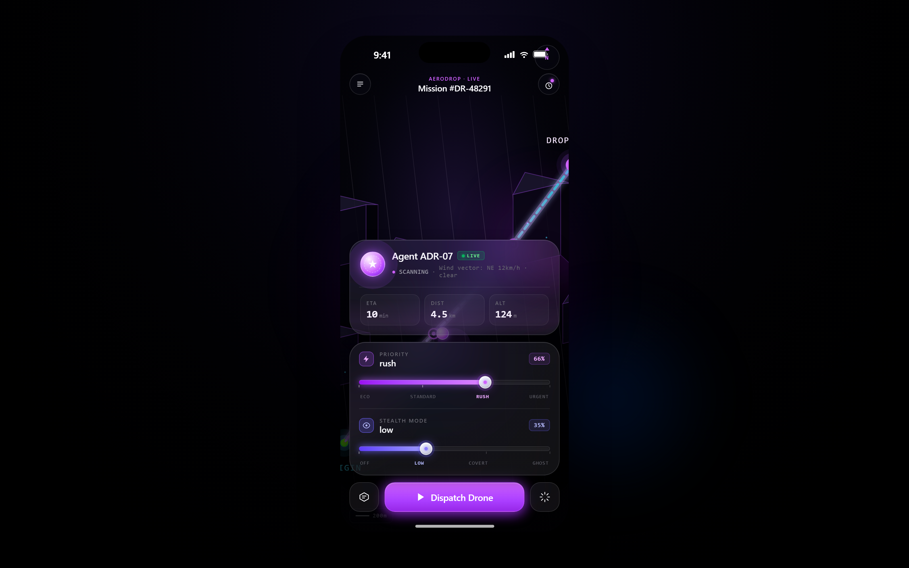
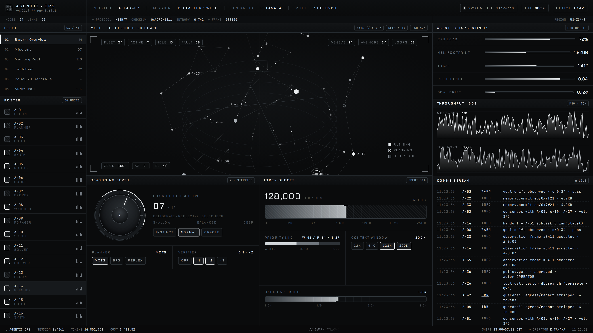
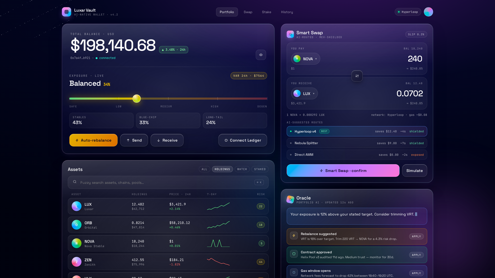
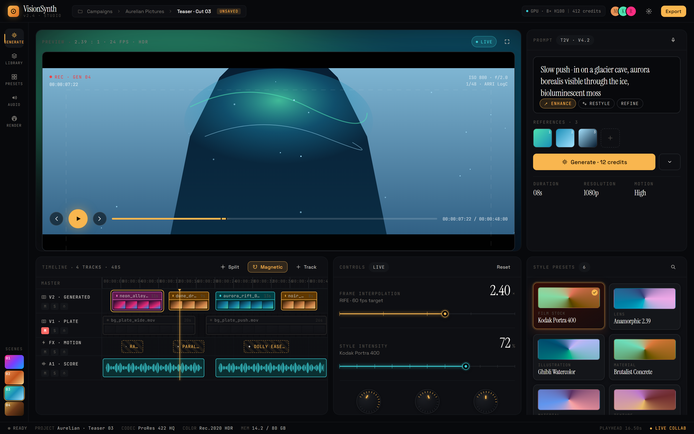

<div align="center">

# Claude Design Handoff Vault

**8 production-grade UI prototypes — exported from Claude Design, screenshot by Playwright, ready to fork.**

[](https://github.com/miikeey1100/Claude-Design-Handoff-Vault/stargazers)
[](https://github.com/miikeey1100/Claude-Design-Handoff-Vault/stargazers)
[](LICENSE)

[**⭐ Star to hit the 5K goal**](https://github.com/miikeey1100/Claude-Design-Handoff-Vault) · [Gallery ↓](#gallery) · [1-Click Setup ↓](#1-click-setup) · [Design Contract](CLAUDE.md)

</div>

---

> Every screenshot below was generated by `npm run capture`.
> Two design families: **Liquid Glass** (deep oklch, backdrop blur) and **Monochrome** (silver/ink, 4px baseline). See [CLAUDE.md](CLAUDE.md).

## 1-Click Setup

```bash
npx degit miikeey1100/Claude-Design-Handoff-Vault vault && cd vault && npm run setup && npm run capture
```

That's it. Three steps:

1. `degit` clones without git history.
2. `npm run setup` installs `playwright-chromium` + the headless browser.
3. `npm run capture` re-renders every bundle and writes fresh PNGs to `/previews`.

Open any file in `bundles/<slug>/project/` in your browser to play with it live.

---

## Gallery

| | |
|---|---|
| **AeroDrop** — Autonomous AI Delivery · *Liquid Glass* <br><sub>[`bundles/aerodrop-luxury-ui/`](bundles/aerodrop-luxury-ui/project/AeroDrop.html)</sub><br><br> | **Agentic Ops** — Swarm Console · *Monochrome* <br><sub>[`bundles/agentic-ops/`](bundles/agentic-ops/project/Agentic%20Ops.html)</sub><br><br> |
| **BioPulse** — AI Health Tracker · *Liquid Glass* <br><sub>[`bundles/biopulse-ai/`](bundles/biopulse-ai/project/BioPulse.html)</sub><br><br> | **Luxar Vault** — AI Crypto Wallet · *Liquid Glass* <br><sub>[`bundles/holowallet/`](bundles/holowallet/project/Luxar%20Vault.html)</sub><br><br> |
| **Orchestrator** — LogicChain · *Monochrome* <br><sub>[`bundles/logicchain/`](bundles/logicchain/project/Orchestrator.html)</sub><br><br> | **NeuralStore** — Engineered for Signal · *Monochrome (light)* <br><sub>[`bundles/neuralstore/`](bundles/neuralstore/project/NeuralStore.html)</sub><br><br> |
| **Frontier** — AI-native IDE · *Monochrome* <br><sub>[`bundles/vibe-design/`](bundles/vibe-design/project/Frontier%20Landing.html)</sub><br><br> | **VisionSynth** — AI Video Generator · *Liquid Glass* <br><sub>[`bundles/visionsynth/`](bundles/visionsynth/project/VisionSynth.html)</sub><br><br> |

---

## Design tokens at a glance

| | Liquid Glass | Monochrome |
|---|---|---|
| Surface | `oklch(0.09 0.04 260)` + radial wash | `#0a0b0c` flat, hairline grids |
| Panel | `oklch(1 0 0 / 0.04)` + 16px blur | `#111315`, no blur |
| Stroke | `oklch(1 0 0 / 0.10)` | `#23282d`, 1px |
| Type — display | SF Pro Display / Space Grotesk | Chakra Petch / Space Grotesk |
| Type — mono | JetBrains Mono | JetBrains Mono |
| Radius | 10 / 16 / 24 / 32 | 0–6 only |
| Accent | None (color comes from wash) | One. `#00b872`. Earned. |
| Baseline | 8px | 4px |

Full contract → [**CLAUDE.md**](CLAUDE.md)

---

## How it works

```
bundles/<slug>/project/*.html     ← exported from claude.ai/design
        │
        ▼
scripts/capture.mjs               ← Playwright + a 50-line static HTTP server
        │
        ▼
previews/<slug>.png               ← 1600×1000 @ 2x retina
```

No build step. No framework lock-in. Each `bundles/<slug>/` is a self-contained handoff bundle you can drop into your own codebase and recreate in React/Vue/Swift/whatever.

---

## Contributing a new bundle

1. Export from [claude.ai/design](https://claude.ai/design) → drop into `bundles/<slug>/`.
2. Pick a family (Liquid Glass or Monochrome) — see [CLAUDE.md](CLAUDE.md).
3. Add a row to the slug table in `scripts/capture.mjs`.
4. `npm run capture` — commit the new PNG.
5. Add a gallery cell to this README.
6. Open a PR.

---

<div align="center">

## Help us hit 5,000 ⭐

If you'd ship even one of these screens, **star the repo**.
Every star unlocks one more handoff bundle. (Goal: 32 by EOY.)

[**⭐ Star Claude-Design-Handoff-Vault**](https://github.com/miikeey1100/Claude-Design-Handoff-Vault)

Tweet it · [Share on HN](marketing/hn-show.md) · [Reddit kit](marketing/)

MIT licensed · prototypes by Claude Design · pipeline by you

</div>
