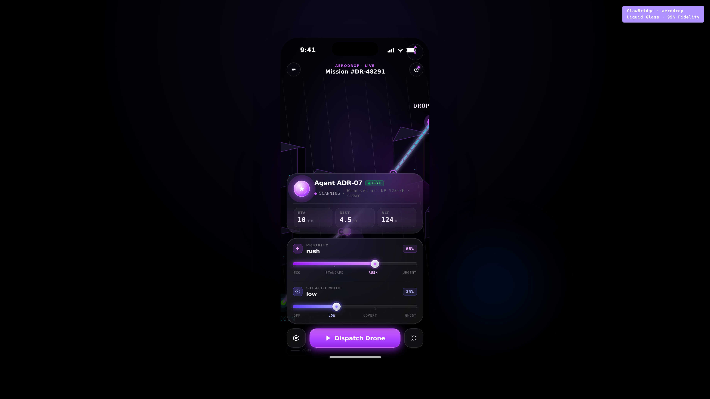
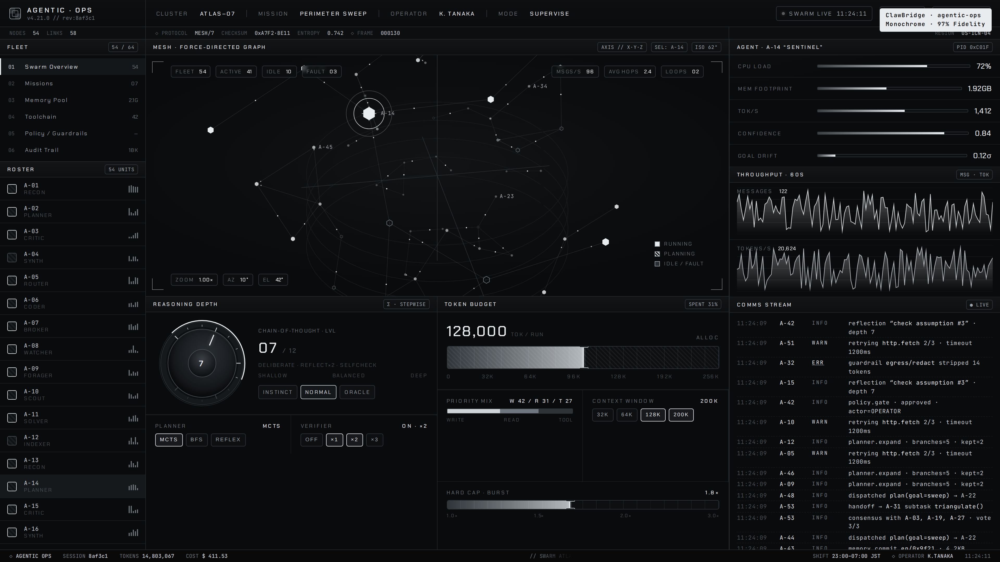
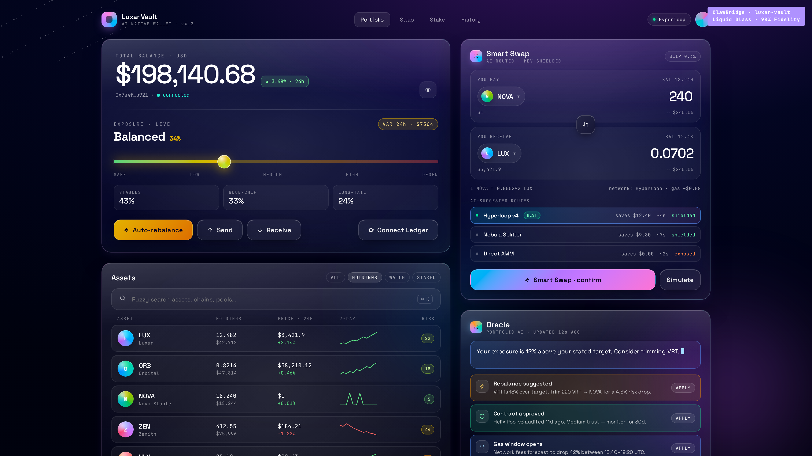
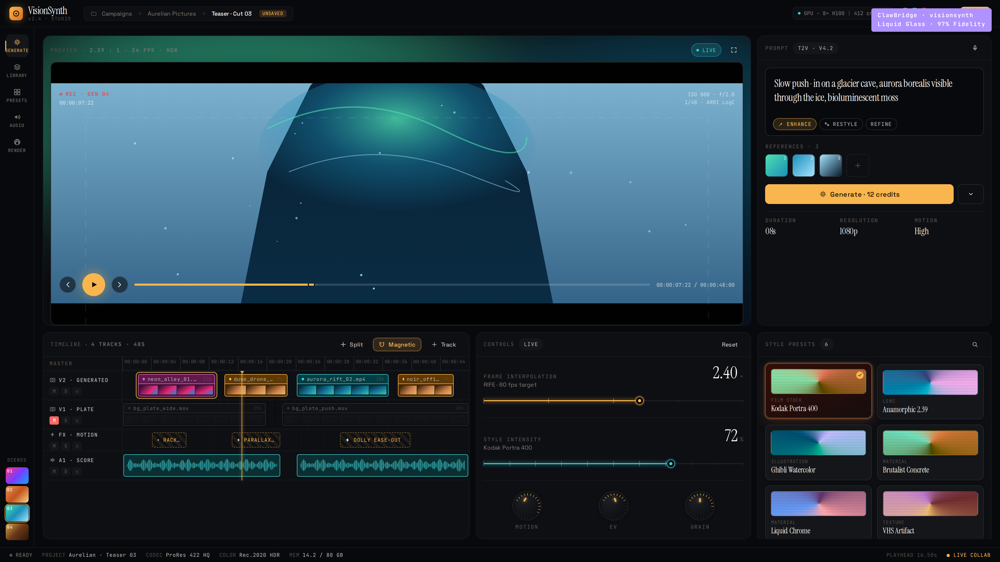
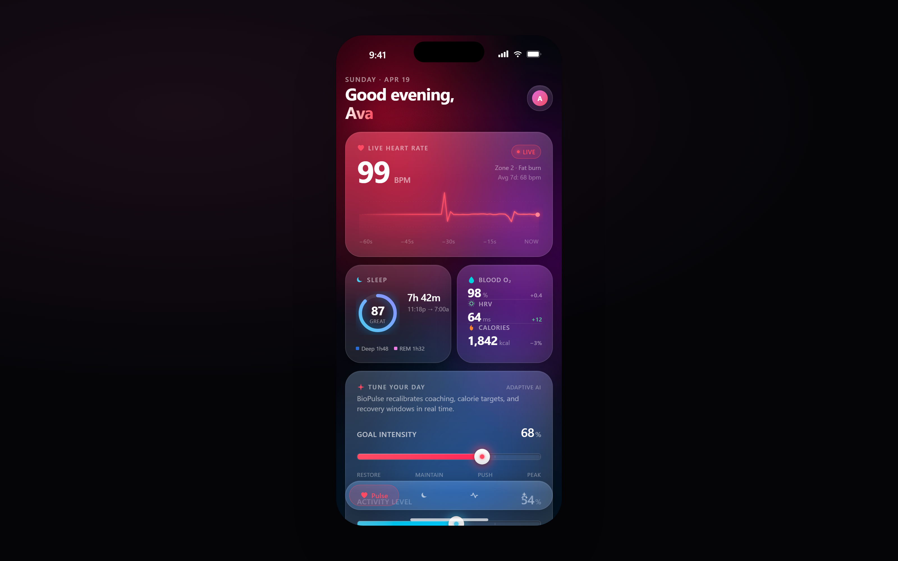
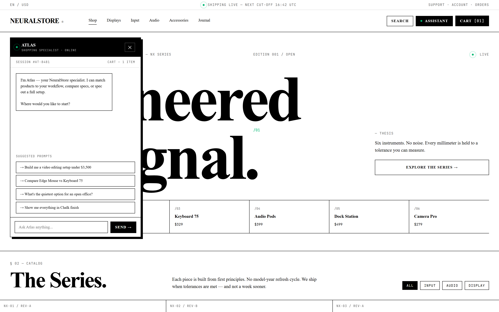
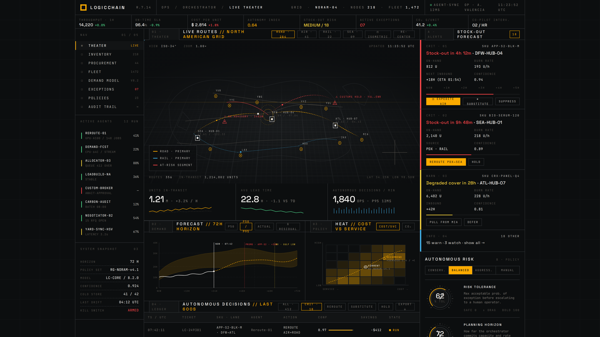
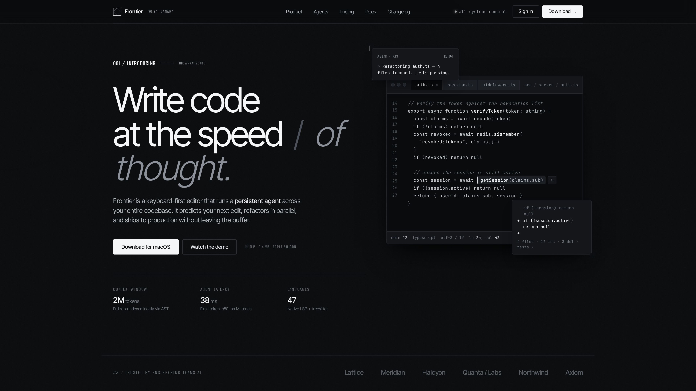

<div align="center">

# ⬡ Handoff-CDN

### The Design-to-Code Protocol for Claude

**Stream pixel-perfect UI bundles from a community CDN directly into Claude Code — one command.**

[](https://www.npmjs.com/package/handoff-cdn)
[](https://github.com/miikeey1100/Claude-Design-Handoff-Vault/stargazers)
[](LICENSE)
[](manifest.json)

</div>

---

## The Protocol

Handoff-CDN is not just a CLI — it's a **three-layer protocol**:

```
manifest.json          CDN registry of all design bundles
bin/handoff-cdn.js      Fetch layer: pulls bundle, builds implementation prompt
CLAUDE.md + SKILL.md   Contract layer: token rules Claude Code enforces automatically
```

Every bundle ships with its full HTML prototype, design-token family, and the original user intent transcript. Claude Code gets a **complete, constrained brief** — not a vague description.

---

## Magic Command

```bash
npx handoff-cdn use aerodrop | claude
```

```bash
# Or with -p flag
claude -p "$(npx handoff-cdn use luxar-vault)"

# Pipe to a file, edit, then run
npx handoff-cdn use visionsynth > brief.txt && claude < brief.txt

# Browse all bundles
npx handoff-cdn list

# Install as a permanent Claude Skill
npx handoff-cdn skill install
```

> **Record your own demo GIF:** `vhs marketing/record-demo.tape` — see [marketing/record-demo.tape](marketing/record-demo.tape)

---

## Bundle Registry — 8 Bundles, 2 Families

### ✦ Elite Tier — 4 Flagship Bundles

| Code Fidelity Preview | Bundle | Family | Fidelity | Command |
|---|---|---|---|---|
|  | **AeroDrop**<br>Autonomous AI Delivery | Liquid Glass | **99% CSS Match** | `npx handoff-cdn use aerodrop` |
|  | **Agentic Ops**<br>Swarm Console | Monochrome | **97% CSS Match** | `npx handoff-cdn use agentic-ops` |
|  | **Luxar Vault**<br>AI Crypto Wallet | Liquid Glass | **98% CSS Match** | `npx handoff-cdn use luxar-vault` |
|  | **VisionSynth**<br>AI Video Generator | Liquid Glass | **97% CSS Match** | `npx handoff-cdn use visionsynth` |

### ◆ Extended Library — 4 Additional Bundles

| Preview | Bundle | Family | Fidelity | Command |
|---|---|---|---|---|
|  | **BioPulse** — AI Health Tracker | Liquid Glass | 96% | `npx handoff-cdn use biopulse` |
|  | **NeuralStore** — Engineered for Signal | Monochrome | 96% | `npx handoff-cdn use neuralstore` |
|  | **Orchestrator** — LogicChain | Monochrome | 95% | `npx handoff-cdn use orchestrator` |
|  | **Frontier** — AI-native IDE | Monochrome | 94% | `npx handoff-cdn use frontier` |

### What is Fidelity Score?

Each score is an honest assessment of the prompt's completeness against the original design: **color token coverage** (oklch values, not approximations), **layout accuracy** (spacing, radii, blur), **type fidelity** (weights, tracking, font stacks), and **interactive state coverage**. 99% = every token, every state, nothing left to guesswork.

---

## Design Families

Every Handoff-CDN bundle belongs to one of two families. Mixing is explicitly banned in [CLAUDE.md](CLAUDE.md).

| | ✦ Liquid Glass | ◆ Monochrome |
|---|---|---|
| Surface | `oklch(0.09 0.04 260)` + radial wash | `#0a0b0c` flat, hairline grids |
| Panel | `oklch(1 0 0 / 0.04)` + `blur(16px)` | `#111315`, no blur |
| Stroke | `oklch(1 0 0 / 0.10)` | `#23282d`, 1px only |
| Type | SF Pro Display / Space Grotesk | Chakra Petch / Space Grotesk |
| Mono | JetBrains Mono | JetBrains Mono |
| Radius | 10 / 16 / 24 / 32px | 0–6px only |
| Accent | Wash-driven, no single token | `#00b872` — one, earned |
| Baseline | 8px | 4px strict |

---

## Install as a Permanent Claude Skill

```bash
npx handoff-cdn skill install
```

This writes the Handoff-CDN token contract into your `./CLAUDE.md`. Every Claude Code session in that directory will automatically enforce fidelity rules — no flags, no reminders.

See [SKILL.md](SKILL.md) for manual install, what the skill enforces, and how to uninstall.

---

## Protocol Internals

```bash
# Inspect the CDN registry
npx handoff-cdn manifest

# Get metadata + preview URL for a specific bundle
npx handoff-cdn info aerodrop
```

The [`manifest.json`](manifest.json) is machine-readable and stable — build on top of it.

---

## ⭐ Star for the Anthropic OSS Grant

Handoff-CDN runs on GitHub Raw as a free community CDN. To keep it open-source and fund the next phase, we're applying for the **Anthropic OSS Grant**.

**Goal: 5,000 stars → grant application.**

The grant funds:
- `npx handoff-cdn new` — export your own Claude Design bundle to the CDN
- CLI auto-update when new bundles drop (`npx handoff-cdn update`)
- GitHub Action: auto-regenerate comparison previews on every PR
- 32 total bundles by EOY (currently 8)

[**⭐ Star Handoff-CDN now**](https://github.com/miikeey1100/Claude-Design-Handoff-Vault/stargazers) — every star is a vote for a free, open design-to-code infrastructure.

---

## Contributing a Bundle

1. Export from [claude.ai/design](https://claude.ai/design) → drop into `bundles/<slug>/`
2. Pick a family (Liquid Glass or Monochrome) — see [CLAUDE.md](CLAUDE.md)
3. Add an entry to [`manifest.json`](manifest.json)
4. Add a row to the `bin/handoff-cdn.js` fetch map (if needed)
5. `npm run compare` — commit the new fidelity screenshot
6. Add a row to the gallery above
7. Open a PR

---

<div align="center">

MIT licensed · designs by [claude.ai/design](https://claude.ai/design) · protocol by [miikeey1100](https://github.com/miikeey1100)

**[manifest.json](manifest.json) · [CLAUDE.md](CLAUDE.md) · [SKILL.md](SKILL.md) · [marketing/](marketing/)**

</div>
